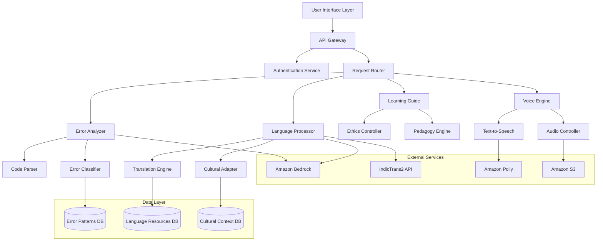
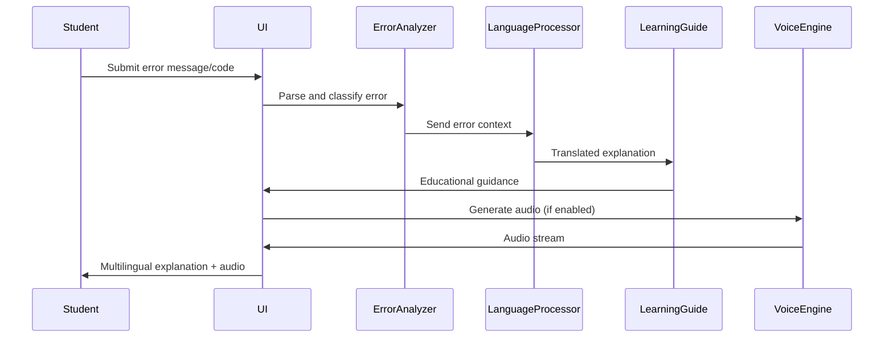
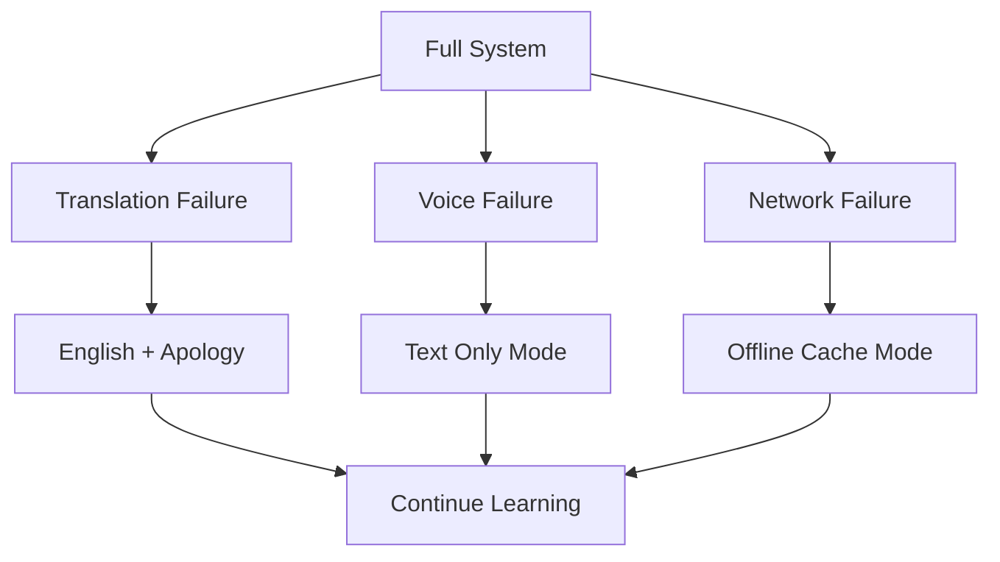

# Design Document: Code-Dost Multilingual Debugging Assistant

## Overview

Code-Dost is a multilingual, voice-enabled AI debugging assistant designed specifically for Indian engineering students. The system transforms English-only programming error messages into culturally relevant, educational explanations in native Indian languages. Rather than providing direct solutions, Code-Dost guides students through conceptual understanding and self-discovery of debugging techniques.

The architecture emphasizes educational ethics, ensuring students learn debugging skills rather than copying solutions. The system supports major Indian languages (Hindi, Tamil, Telugu, Bengali, Marathi) with optional voice synthesis for enhanced accessibility.

## Architecture

### High-Level Architecture



## Proposed Technology Stack

### Core AWS Services

- **Amazon Bedrock**: LLM for intelligent code analysis and multilingual error explanation generation
- **Amazon Polly**: Text-to-Speech synthesis for regional Indian language audio output  
- **Amazon S3**: Temporary session storage for user interactions and error context (optional)

### Technology Stack Rationale

**Amazon Bedrock** serves as the primary LLM provider due to its:
- Built-in multilingual capabilities supporting Indian languages
- Managed service reducing infrastructure complexity
- Prompt guardrails ensuring educational ethics and academic integrity
- Scalable inference suitable for student populations

**Amazon Polly** provides authentic voice synthesis with:
- Native support for Indian English and regional language variants
- Neural voice models for natural-sounding educational content
- Real-time streaming capabilities for responsive user experience

### Component Interaction Flow



## Components and Interfaces

### Error Analyzer Component

**Purpose**: Processes programming errors and extracts meaningful context for educational explanation.

**Key Interfaces**:
- `analyzeError(errorMessage: string, sourceCode: string, language: ProgrammingLanguage): ErrorContext`
- `classifyErrorType(error: ErrorContext): ErrorCategory`
- `extractRelevantContext(sourceCode: string, errorLocation: Location): CodeContext`

**Implementation Details**:
- Integrates with Amazon Bedrock for intelligent error analysis and explanation generation
- Uses IndicTrans2 for high-quality Indian language translation as a secondary service
- Maintains error pattern database for common student mistakes
- Prioritizes errors by educational impact (syntax → logic → runtime)

### Language Processor Component

**Purpose**: Translates technical content to native Indian languages with cultural adaptation.

**Key Interfaces**:
- `translateExplanation(content: string, targetLanguage: IndianLanguage): string`
- `adaptCulturally(explanation: string, region: IndianRegion): string`
- `generateAnalogies(concept: string, language: IndianLanguage): Analogy[]`

**Implementation Details**:
- Leverages Amazon Bedrock for multilingual explanation generation with built-in guardrails
- Integrates with IndicTrans2 for specialized Indian language translation
- Maintains technical terminology dictionaries for programming concepts
- Uses cultural context database for region-specific analogies
- Supports Hinglish with natural code-switching patterns

### Learning Guide Component

**Purpose**: Provides educational guidance while maintaining academic integrity.

**Key Interfaces**:
- `generateGuidance(errorContext: ErrorContext, studentLevel: Level): LearningPath`
- `validateEthicalResponse(response: string): boolean`
- `createSocraticQuestions(concept: string): Question[]`

**Implementation Details**:
- Ethics controller prevents direct solution provision
- Pedagogy engine creates step-by-step learning paths
- Uses Socratic questioning to guide student discovery
- Tracks common misconceptions for targeted explanations

### Voice Engine Component

**Purpose**: Converts text explanations to natural-sounding speech in Indian languages.

**Key Interfaces**:
- `synthesizeSpeech(text: string, language: IndianLanguage, voice: VoiceProfile): AudioStream`
- `adjustPacing(audio: AudioStream, learningContext: Context): AudioStream`
- `generateEmphasis(text: string, keyTerms: string[]): AnnotatedText`

**Implementation Details**:
- Integrates with Amazon Polly for natural-sounding Indian language synthesis
- Supports playback controls (pause, replay, speed adjustment)
- Emphasizes technical terms with natural intonation
- Optimized for educational pacing and clarity

## Data Models

### Core Data Structures

```typescript
interface ErrorContext {
  errorType: ErrorCategory;
  errorMessage: string;
  sourceCode: string;
  programmingLanguage: ProgrammingLanguage;
  location: CodeLocation;
  severity: ErrorSeverity;
  educationalPriority: number;
}

interface LearningPath {
  conceptualExplanation: string;
  guidingQuestions: Question[];
  hints: Hint[];
  relatedConcepts: string[];
  culturalAnalogies: Analogy[];
}

interface TranslationContext {
  sourceLanguage: Language;
  targetLanguage: IndianLanguage;
  technicalDomain: TechnicalDomain;
  culturalRegion: IndianRegion;
  formalityLevel: FormalityLevel;
}

interface VoiceProfile {
  language: IndianLanguage;
  gender: VoiceGender;
  age: VoiceAge;
  accent: RegionalAccent;
  speed: SpeechSpeed;
}
```

### Language and Cultural Models

```typescript
enum IndianLanguage {
  HINDI = "hi",
  TAMIL = "ta", 
  TELUGU = "te",
  BENGALI = "bn",
  MARATHI = "mr",
  HINGLISH = "hi-en"
}

enum ProgrammingLanguage {
  PYTHON = "python",
  JAVA = "java",
  C = "c",
  CPP = "cpp"
}

interface CulturalContext {
  region: IndianRegion;
  commonAnalogies: Map<string, string>;
  educationalNorms: EducationalNorm[];
  communicationStyle: CommunicationStyle;
}
```

## Correctness Properties

*A property is a characteristic or behavior that should hold true across all valid executions of a system—essentially, a formal statement about what the system should do. Properties serve as the bridge between human-readable specifications and machine-verifiable correctness guarantees.*

Based on the prework analysis, the following properties ensure system correctness:

### Property 1: Error Analysis Completeness
*For any* valid compiler error message or source code with errors, the Error_Analyzer should always produce a valid error category and extract relevant code context
**Validates: Requirements 1.1, 1.2, 1.4**

### Property 2: Error Prioritization Consistency  
*For any* code containing multiple errors, the Error_Analyzer should prioritize errors by educational impact in a consistent, deterministic manner
**Validates: Requirements 1.3**

### Property 3: Multilingual Translation Coverage
*For any* error explanation and supported Indian language combination, the Language_Processor should generate a valid translation with appropriate cultural adaptation
**Validates: Requirements 2.1, 2.2, 8.1, 8.3**

### Property 4: Hinglish Code-Switching Consistency
*For any* technical explanation in Hinglish, technical terms should appear in English while explanatory text uses Hindi, maintaining natural code-switching patterns
**Validates: Requirements 2.4**

### Property 5: Voice Synthesis Completeness
*For any* text explanation and supported language, when audio is enabled, the Voice_Engine should generate corresponding audio with functional playback controls
**Validates: Requirements 3.1, 3.4**

### Property 6: Educational Guidance Structure
*For any* debugging assistance request, the Learning_Guide should provide conceptual explanations before suggestions, include guiding questions, and offer hints rather than direct solutions
**Validates: Requirements 4.1, 4.2, 4.4**

### Property 7: Academic Integrity Enforcement
*For any* student request (including direct solution requests), the system should never provide complete code solutions and should redirect to educational explanations instead
**Validates: Requirements 4.3, 5.1, 5.2, 5.3, 5.4**

### Property 8: Programming Language Support Coverage
*For any* error from Python, Java, C, or C++, the Error_Analyzer should process it successfully and provide language-appropriate explanations
**Validates: Requirements 6.1, 6.2**

### Property 9: Terminology Consistency Across Contexts
*For any* programming concept translated to a native language, the same terminology should be used consistently across different programming languages and contexts
**Validates: Requirements 6.3, 6.4**

### Property 10: System Performance Standards
*For any* basic query under normal or low-bandwidth conditions, the system should respond within 3 seconds and maintain functionality
**Validates: Requirements 7.2, 7.3**

### Property 11: Accessibility Compliance
*For any* system interface element, it should be accessible via screen readers and keyboard navigation when accessibility features are enabled
**Validates: Requirements 7.4**

### Property 12: Indian Language Support Coverage
*For any* of the major Indian languages (Hindi, Tamil, Telugu, Bengali, Marathi), the system should provide full translation and voice synthesis support
**Validates: Requirements 8.2**

### Property 13: Regional Communication Adaptation
*For any* explanation generated for a specific Indian region, the communication style should match regional educational norms and preferences
**Validates: Requirements 8.4**

### Property 14: Learning Progress Tracking
*For any* student interaction, error types should be tracked, successful resolutions should trigger positive reinforcement, and improvement should be acknowledged
**Validates: Requirements 9.1, 9.2, 9.4**

### Property 15: Resource Recommendation Consistency
*For any* common error pattern, the system should suggest relevant additional learning resources
**Validates: Requirements 9.3**

### Property 16: Data Protection Compliance
*For any* student code or usage data, processing should use encryption or local processing, avoid permanent storage without consent, and anonymize personal information
**Validates: Requirements 10.1, 10.2, 10.3**

<function_calls>
<invoke name="prework">
<parameter name="featureName">code-dost-multilingual-debugging-assistant

## Error Handling

### Error Categories and Recovery

**System Errors**:
- Translation service failures → Fallback to English with apology message
- Voice synthesis failures → Continue with text-only mode
- Network connectivity issues → Enable offline mode with cached responses

**Input Validation Errors**:
- Invalid programming language → Request clarification with supported language list
- Malformed error messages → Attempt best-effort parsing with confidence indicators
- Empty or corrupted code → Request code re-submission with helpful guidance

**Educational Ethics Violations**:
- Direct solution requests → Redirect to conceptual explanations
- Academic dishonesty patterns → Promote ethical learning practices
- Repeated solution-seeking → Escalate to educational guidance mode

### Graceful Degradation Strategy



## Testing Strategy

### Dual Testing Approach

The system requires both unit testing and property-based testing for comprehensive coverage:

**Unit Tests**: Verify specific examples, edge cases, and error conditions
- Test specific compiler error message parsing
- Validate translation accuracy for known technical terms
- Verify voice synthesis for sample phrases
- Test UI accessibility with screen readers
- Validate cultural adaptation for specific regions

**Property Tests**: Verify universal properties across all inputs  
- Test error analysis completeness across all programming languages
- Verify translation consistency across all language combinations
- Validate academic integrity enforcement for all request types
- Test performance standards under various load conditions
- Verify data protection compliance across all data flows

### Property-Based Testing Configuration

**Testing Framework**: Use Hypothesis (Python) or fast-check (TypeScript) for property-based testing
**Test Configuration**: Minimum 100 iterations per property test to ensure comprehensive input coverage
**Test Tagging**: Each property test must reference its design document property using the format:
`**Feature: code-dost-multilingual-debugging-assistant, Property {number}: {property_text}**`

**Example Property Test Structure**:
```python
@given(error_messages=compiler_errors(), languages=indian_languages())
def test_translation_coverage(error_message, target_language):
    """Feature: code-dost-multilingual-debugging-assistant, Property 3: Multilingual Translation Coverage"""
    result = language_processor.translate(error_message, target_language)
    assert result.is_valid_translation()
    assert result.target_language == target_language
    assert result.contains_cultural_adaptation()
```

### Integration Testing Strategy

**End-to-End Workflows**:
- Student submits Python error → receives Hindi explanation with voice
- Student requests direct solution → receives educational redirection  
- Student uses low-bandwidth connection → receives optimized response
- Student enables accessibility → interface works with screen readers

**Cross-Component Testing**:
- Error Analyzer + Language Processor integration
- Language Processor + Voice Engine coordination
- Learning Guide + Ethics Controller validation
- All components + Performance monitoring

### Cultural and Linguistic Testing

**Native Speaker Validation**:
- Recruit native speakers for translation quality assessment
- Validate cultural appropriateness of analogies and examples
- Test voice synthesis naturalness across regional accents
- Verify educational effectiveness with target student populations

**Regional Adaptation Testing**:
- Test communication style adaptation for different Indian regions
- Validate technical terminology consistency across contexts
- Verify cultural reference appropriateness for target demographics